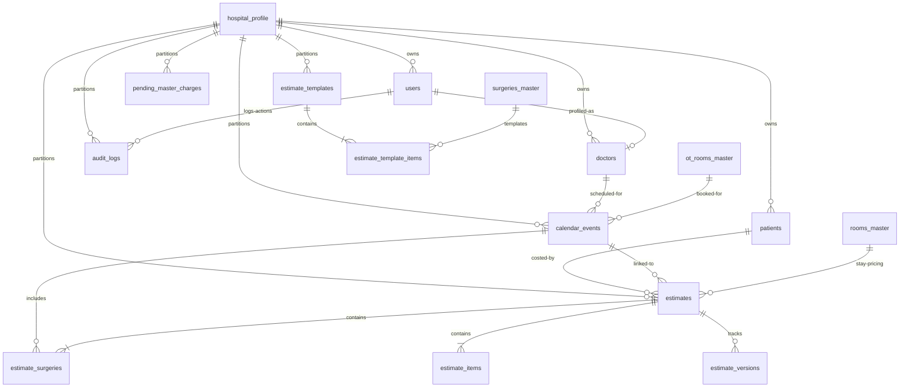

<!-- 
  Purpose: Document the PostgreSQL Entity Relationship Diagram (ERD) 
  and strategic specifications (soft-delete, multi-tenancy, and retention).
-->
# Cliniq-OX: Database Schema Overview

This document defines the Entity Relationship Diagram (ERD) and strategic policies for the Cliniq-OX PostgreSQL database.

---

## 1. Entity Relationship Diagram (ERD)

---

## 2. Relational Table Specifications

To maintain a clean directory structure and keep files strictly under 200 lines, the 17 table reviews are categorized in modular sub-documents:
1. **[Identity & Patients Profile Spec](file:///Users/Shared/Mobile%20app%20cliniq-OX/docs/database/identity-master.md):** Defines `hospital_profile`, `users`, `doctors`, and `patients`.
2. **[Scheduling & Master Configurations Spec](file:///Users/Shared/Mobile%20app%20cliniq-OX/docs/database/scheduling.md):** Defines `calendar_events`, `surgery_master`, `ot_rooms_master`, `rooms_master`, `hospital_charges_master`, and `pending_master_charges`.
3. **[Estimates & Pricing Spec](file:///Users/Shared/Mobile%20app%20cliniq-OX/docs/database/estimating.md):** Defines `estimates`, `estimate_surgeries`, `estimate_items`, `estimate_versions`, `estimate_templates`, and `estimate_template_items`.
4. **[Audit Logs Spec](file:///Users/Shared/Mobile%20app%20cliniq-OX/docs/database/audits.md):** Defines `audit_logs`.

---

## 3. Database Strategies

### 3.1 Multi-Hospital Tenant Strategy
- **Partition Key:** A `hospital_id UUID` column is required on all tenant records.
- **Enforcement:** Query layers must inject `WHERE hospital_id = ?` derived from JWT tokens or headers to ensure hospital isolation.

### 3.2 Soft-Delete Strategy
- **Metadata Fields:** `is_active BOOLEAN DEFAULT TRUE`, `deleted_at TIMESTAMP`, and `deleted_by UUID`.
- **Coverage:** Extended across transactions (`estimates`, `estimate_items`, `estimate_surgeries`, `calendar_events`, `pending_master_charges`, `estimate_templates`).

### 3.3 Data Retention & Archival
- **Active Data:** Estimates, schedules, and logs remain in high-performance tables.
- **Archival:** Records marked soft-deleted for more than 7 years are compressed and archived to cold file storage (Amazon S3 Glacier), freeing database space.
