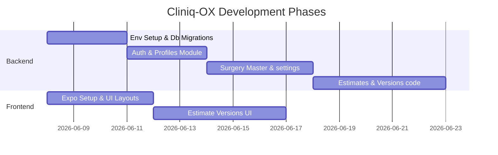

<!-- 
  Purpose: Map out development phases, change management, backup strategies, 
  and validation workflows for Cliniq-OX.
-->
# Cliniq-OX: Implementation Roadmap

This document outlines the milestones, change management pipelines, and backup plans.

---

## 1. Development Phases

---

## 2. Change Management Workflow
Before writing or modifying source code, developers must generate a **Change Proposal** under `docs/change-proposals/vX.X.X.md` containing:
- **Metadata:** Version, Date, Author.
- **Purpose:** Detailed description of what the change accomplishes.
- **Affected Elements:** Files to modify, files to create.
- **Impact Analysis:** Database schema changes, API endpoints, UI screens.
- **Risk Assessment & Rollback Plan:** Potential issues, detailed rollback terminal commands.
Wait for architect/admin approval before executing the changes.

---

## 3. Backup Strategy
Before executing approved code updates, create a directory backup:
- **Path Structure:** `backups/vX.X.X/`
- **Backup Package Contents:**
  - `source/`: Copy of files to be modified.
  - `migrations/`: Prisma migrations or raw SQL script backups.
  - `release-notes/`: Release notes detailing version changes.
  - `rollback.md`: Step-by-step instructions to revert files and restore the database state.

---

## 4. Audit & Soft-Delete Strategy
- **Audit Logging:** Logs user action, target ID, and snapshots (`user_name_snapshot` and `user_role_snapshot`) to preserve audit details independent of user profile updates.
- **Soft-Deletes:** Appended to estimates, items, surgeries, pending charges, doctor templates, and calendar events. Database queries must filter by `is_active = true`.
