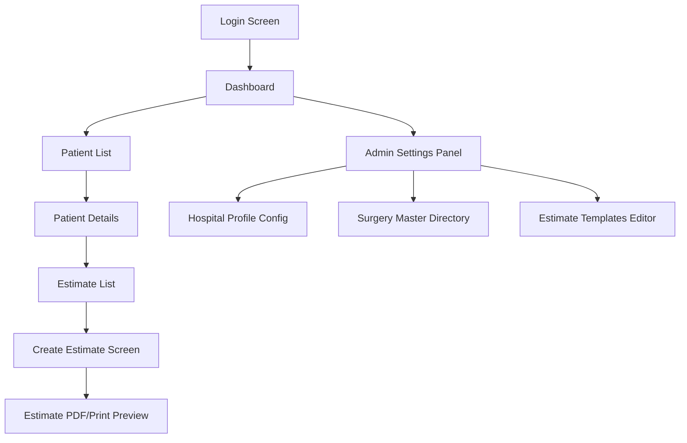

<!-- 
  Purpose: Define the application page navigation structure and user screen 
  transitions including patient estimates and templates.
-->
# Cliniq-OX: UI Navigation Flow

This document details the navigation path and user transitions for the Cliniq-OX application.

---

## 1. Application Screen Transitions

---

## 2. Screen Descriptions

### 2.1 Create Estimate Screen
- **Header:** Automatically binds and displays Hospital Details.
- **Top Panel:** Patient Details (Name, Age, UHID) and Surgery Details (Name, Category, default Fee).
- **Control Bar:**
  - Toggle: **[Manual Mode] / [Template Mode]**
  - Dropdown: Select Estimate Template (visible only in Template Mode).
- **Estimate Items Table:**
  - Columns: Description, Quantity, Rate, Amount, Actions.
  - Buttons: **Add Charge Item** (appends blank line), **Remove** (deletes line).
- **Calculation Panel:** Real-time displays for Subtotal, Discount input field, Taxable amount, GST rate selection, and Grand Total.
- **Footer Controls:** **Save Draft** (saves state to database), **Finalize & Generate PDF** (locks changes, renders PDF preview), **Print**.

### 2.2 Surgery Master Directory
- Search bar to query active/disabled surgeries.
- Form to add new Surgery (Code, Name, Category, Default Fee).
- Toggle switch to active/disable specific entries.

### 2.3 Estimate Templates Screen
- Admin view to manage templates.
- Input fields for Template Name and linked Surgery.
- Line items table to define default quantities and rates.
